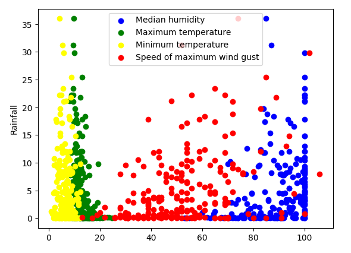
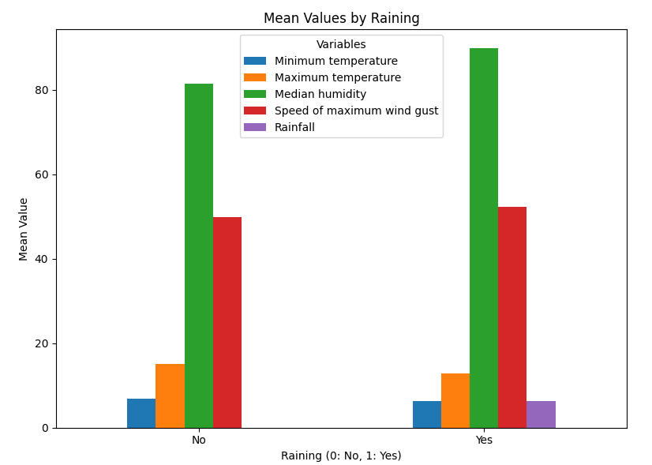

# Data Analysis and Prediction of Rainfall

## Introduction

This repository contains an analysis of rainfall data and attempts to predict rainfall using various machine learning algorithms. The analysis includes data preprocessing, exploration, and model evaluation.
Data Analysis

Upon initial inspection of the data, several issues were identified and addressed:

   * Some columns contain missing data, notably 'Evaporation' and 'Sunshine'.
   * The 'Wind Speed' column contains non-numerical values such as 'Calm', which were converted to numerical values (0).
   * Missing values in the 'Rainfall' column were addressed by populating them with 0.
   * Utilization of daily temperature measurements instead of those recorded at specific times.
   * Aggregation of '9am/3pm relative humidity' measurements into 'Median daily humidity'.
   * Usage of 'Speed of maximum wind gust' measurements instead of individual wind speeds, with missing values filled with the maximum of '9am/3pm wind speed'.
   * The features of the dataset are at different scales so, normalizing it before training will help us to obtain optimum results faster along with stable training.

### Feature Selection

Based on the analysis, the following features were selected for predicting rainfall:

    Minimum temperature
    Maximum temperature
    Median humidity
    Speed of maximum wind gust

## Prediction and Model Evaluation

### Linear Regression

There is no linear relationship between the independent and depended (Rainfall) variables. 

Linear regression was initially attempted but did not yield accurate results:

    Coefficients: [[-0.55605176 -1.09944499 1.00342415 2.15911104]]
    Intercept: [4.88449198]
    Mean Absolute Error: 4.92
    Mean Squared Error: 49.47
    Variance Score (R2-score): 0.24

### K Neighbors Regressor

K Neighbors Regressor was also tried, but the results were not satisfactory:

    k = 4: MAE=4.20, MSE=41.33, R2-score=0.37
    k = 5: MAE=4.06, MSE=40.52, R2-score=0.38
    k = 6: MAE=4.12, MSE=39.73, R2-score=0.39

### Binary Classification

Instead of forecasting the continuous precipitation amount, we'll aim to predict a categorical value indicating whether it will rain or not. To achieve this, I'll introduce a new column called 'Raining' in the dataframe. This column will contain binary values: 1 for raining and 0 for not raining, determined based on the 'Rainfall' column (1 if rainfall exceeds 0). 

Visualize the relationship between this binary (categorical) variable, 'Raining', and the continuous variables in our dataset.

The accuracy metrics:
* The Jaccard Score (similarity coefficient) it measures the similarity between the predicted labels and the true labels. Ranges from 0 to 1, with 1 indicating perfect similarity between the predicted and true labels.
* The F1-Score - 1 indicates perfect precision and recall. A higher F1-Score indicates better overall performance of the classifier in terms of both precision and recall.
* Accuracy score calculates the ratio of correctly classified samples out of the total number of samples.
* Precision is the ratio of true positives to the total predicted positives for a class.
Recall is the ratio of true positives to the total actual positives for a class.

Classification Performance Evaluation

### KNN Classifier

The K Nearest Neighbors (KNN) classifier was assessed for various values of kk using the `sklearn.metrics.accuracy_score` function. The best accuracy achieved for the test set was 0.8150.815 with k=7.

~~~
F1-Score: 0.7757085020242914
Jaccard Index: 0.6864468864468865
              precision    recall  f1-score   support

           0       0.50      0.17      0.25        12
           1       0.84      0.96      0.89        53

    accuracy                           0.82        65
~~~

Overall accuracy indicates that 82% of the samples were classified correctly. However, the classifier exhibits limitations in accurately predicting class 0 instances, as evidenced by low precision, recall, and F1-score (The precision for class 0 is 0.5, indicating that the classifier misclassified class 0 instances in half of the time).

### Decision Trees Classifier (max_depth = 4)

The Decision Trees classifier with a maximum depth of 4 was evaluated, yielding the following results:

~~~
F1-Score: 0.7004195804195804
Jaccard Index: 0.5957742914979757
              precision    recall  f1-score   support

           0       0.12      0.08      0.10        12
           1       0.81      0.87      0.84        53

    accuracy                           0.72        65
~~~
The classifier achieved an accuracy of 72%, but with notable challenges in correctly classifying instances of class 0 (the precision is 0.12, which means that only 12% of the samples predicted as class 0 were actually class 0).

### Logistic Regression (with `'newton-cg'` optimizer)

The logistic regression model trained with the 'newton-cg' optimizer produced the following results:

~~~
Jaccard score: 0.8412698412698413
Log Loss: 0.437325861571773
              precision    recall  f1-score   support

           0       1.00      0.17      0.29        12
           1       0.84      1.00      0.91        53

    accuracy                           0.85        65
~~~

The classifier exhibits high precision, recall, and F1-score for class 1, indicating its effectiveness in predicting instances of class 1. However, it struggles with class 0 predictions, as evidenced by low recall and F1-score (The recall for class 0 is low (0.17), meaning that the classifier misses a large number of actual class 0 instances).

The Log Loss is 0.43 (accuracy of the predicted probabilities) indicating that overall accuracy here is not high.

The logistic regression model trained with the `'liblinear'` optimizer yielded identical results to the `'newton-cg'` optimizer.

### Support Vector Machine (SVM)

Various kernel functions (linear, poly, sigmoid, RBF) were tested for the Support Vector Machine (SVM) classifier, all producing identical results:

~~~
Jaccard score: 0.8153846153846154
              precision    recall  f1-score   support

           0       0.00      0.00      0.00        12
           1       0.82      1.00      0.90        53
    accuracy                           0.82        65
~~~

The classifier failed to correctly classify any instances of class 0, as precision, recall, and F1-score are all 0 for class 0. However, it performs well in classifying instances of class 1.
### Conclusion

To improve prediction, binary classification was attempted to predict whether it will rain or not. Various classifiers were evaluated:
~~~
| Algorithm            | Precision | Recall   | F1-score | Accuracy |
|----------------------|-----------|----------|----------|----------|
| KNN                  | 0.774     | 0.815    | 0.776    | 0.815    |
| Decision Trees       | 0.681     | 0.723    | 0.700    | 0.723    |
| Logistic Regression  | 0.871     | 0.846    | 0.798    | 0.846    |
| SVM                  | 0.665     | 0.815    | 0.732    | 0.815    |
~~~

While logistic regression performed relatively better compared to other models, accurately predicting rainfall remained challenging given the features available in the dataset. 

### Contributor

Masha Orfali (masha.orfali@gmail.com)

### References

The raw data for Daily Weather Observations in Luncheon Hill, Tasmania can be found here:  
 [Australian Weather](http://www.bom.gov.au/climate/dwo/202310/html/IDCJDW7030.202310.shtml)

